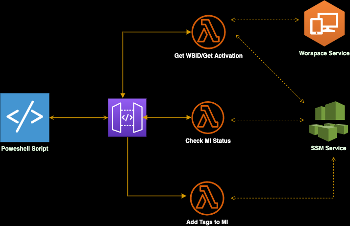

## **Automate SSM client Installation on Workspaces**

This is a solution designed to automate installation & registration of Workspaces as SSM clients. It also adds Tags to the Managed instance (Workspace ID, Assigned User, Directory ID, Region, Hostname and OS along with the AD groups the user is assigned). The AD tags are Dynamic and change as Users AD group memberships change. These Tags can be used a way to create Target groups for SSM tasks such as Pachting, Package Deloyment and Run Command

With Automated Installation of SSM agent, you can use SSM tools such as Patch Managent, run Command, Automation and Distributor to Patch, deploy software and run compliance checks on your Workspace Fleet. You can also use SSM to [Monitor managed node performance](https://docs.aws.amazon.com/systems-manager/latest/userguide/fleet-monitoring.html) for troubleshooting purposes.

##  Usage

The Solution contain the following
*   SAM Template that deploys the API Gateway and the Lambda Function
*   Powershell Script that is deployed to the Workspace Image that automates SSM Agent download, install and configuration
##  Steps to deploy the solution

**Deploy Server Side Stack**
* Clone the Repo to a machine that is configured to deploy resources in AWS.
* [Setup AWS SAM CLI](https://docs.aws.amazon.com/serverless-application-model/latest/developerguide/serverless-sam-cli-install.html) Make sure to follow the steps on installing Docker based on the OS of your choice as we use Docker images 
* Build and deploy the SAM application 

        sam build
        sam deploy --guided
* Provide the Parameters for Region, DNS IP of the AD server, Subnet and security groups for the Lambda function to be created.
* In the Stack output, you get the API Gateway endpoint needed that needed in the Powershell script to install SSM.

**Deploy Script on Workspace**
The client side script is written in Powershell that works on both windows and Linux. Install **Powershell** on a workspace before continuing.
* Clone the Repo to the workspace that is going to have the script installed and be used as Image
* Open Powershell 7 command Prompt as Administrator
* Follow the steps below

        cd workspaces-ssm-install
        cd clientscripts
        ./createscript.ps1
* The script does the following based on the OS
    >  *Windows*
    > - copies the script to C:\ProgramData\ssm_script
    > - Creates a scheduled Task to run the script on startup and on schedule

    >  *Linux*
    > - copies the script to /usr/local/bin
    > - creates systemd service and timer

## Security

See [CONTRIBUTING](CONTRIBUTING.md#security-issue-notifications) for more information.

## License

This library is licensed under the MIT-0 License. See the LICENSE file.

